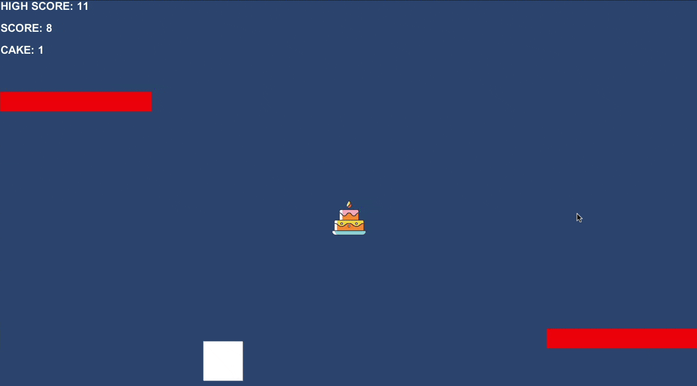

# Infinite Runner Game Demo

A game example built with Unity and the MongoDB Realm SDK. As score accumulates, it is saved locally within Realm and later calculated if it is a high score to be used in the next round.

This game only demonstrates Realm for local storage and does not include the synchronization of data to the MongoDB Cloud.

## Resources

https://www.mongodb.com/developer/how-to/build-infinite-runner-game-unity-realm-unity-sdk/

## Author(s)

[Nic Raboy](https://www.nraboy.com)